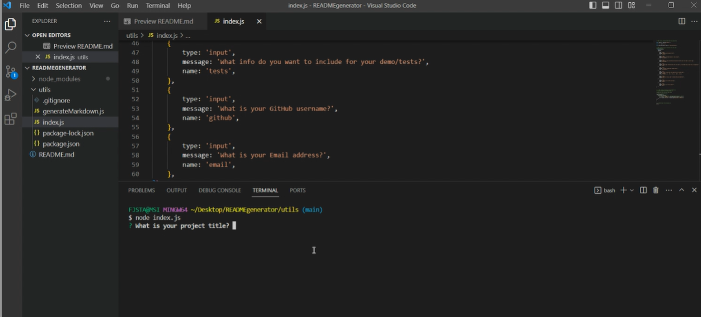
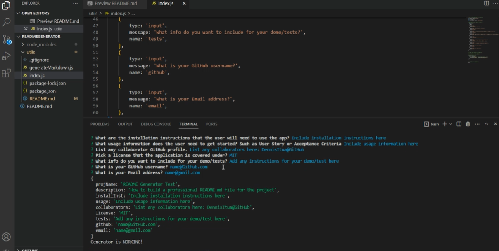
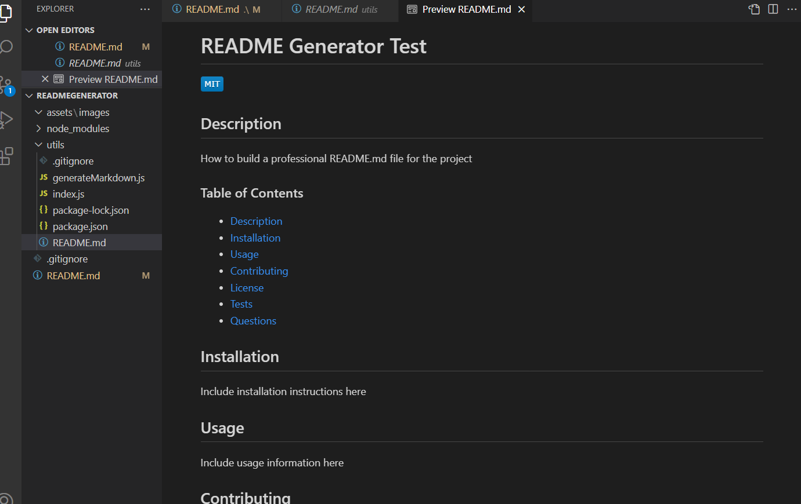
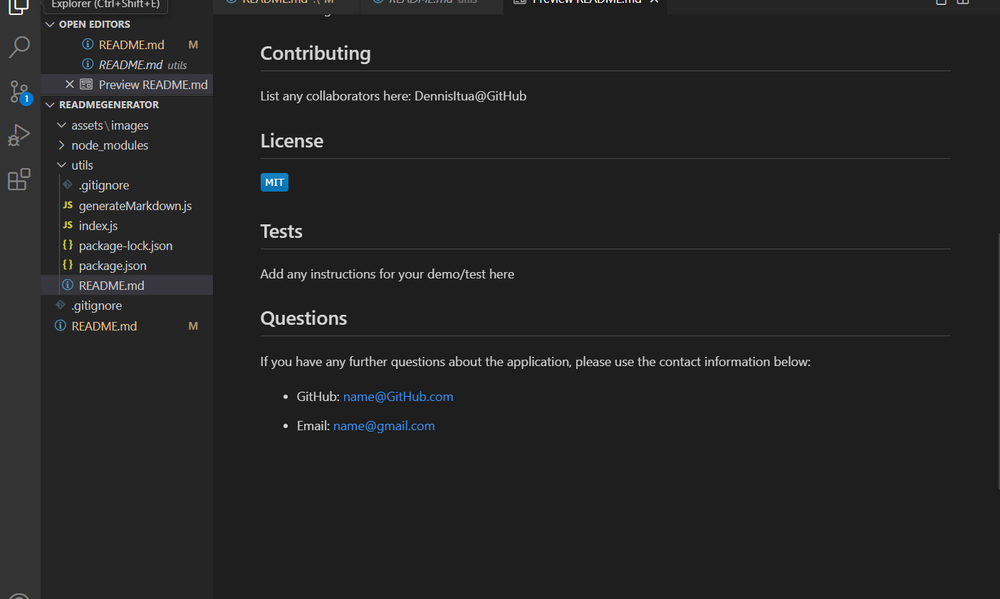

  # README.md GENERATOR


  ## Description

When creating an open source project on GitHub, it’s important to have a high-quality README for the app. This should include what the app is for, how to use the app, how to install it, how to report issues, and how to make contributions&mdash;this last part increases the likelihood that other developers will contribute to the success of the project. 

You can quickly and easily create a README file by using a command-line application to generate one. This allows the project creator to devote more time to working on the project.

Your task is to create a command-line application that dynamically generates a professional README.md file from a user's input using the [Inquirer package](https://www.npmjs.com/package/inquirer/v/8.2.4).

  ### Table of Contents
  
  - [Description](#description)
  - [Installation](#installation)
  - [Usage](#usage)
  - [Contributing](#contributing)
  - [License](#license)
  - [Tests](#tests)
  - [Questions](#questions)


  ## Installation

  First, you will want to make sure that your repo includes a 
  package.json with the required dependencies. You can create
  one by running 'npm init' from the terminal when you first 
  set up the project, before installing any dependencies.

  Then you will install 'inquirer' by entering 'npm i inquirer@8.2.4'
  in your terminal.

  Once installed, the application will be invoked by using the
  following command:

    'node index.js'


  ## Usage


 If you need some guidance, here is some information from 
 [The Full-Stack Blog](https://coding-boot-camp.github.io/full-stack/github/professional-readme-guide)
 on creating a professional README.md file.

 A professional README file describes and explains what the application can do. The bare necessities of a README must include a TITLE, a SHORT DESCRIPTION explaining the what, why, and how of the project.

 The following questions will be asked and prompts the user to answer...

    What is your project title?
    What is the description of your project?
    What are the installation instructions that the user will need to use the app?
    What usage information does the user need to get started? Such as User Story or Acceptance Criteria?
    List any collaborator GitHub profile.
    Pick a license that the application is covered under.
    What info do you want to include for your demo/tests?
    What is your GitHub username?
    What is your Email address?


    Here are some additonal questions you might use in your README.md file as a guide:

    What was your motivation?
    Why did you build this project?
    What problem does it solve?
    What did you learn?
    What makes your project stand out?


Your README might also describe some of the challenges you faced, as well as the features you plan to implement in the future. And if your project is deployed, make sure to include a link to the deployed application so people can see it in action!

For example:

  Click my video link below:


https://github.com/scnowak/READMEgenerator/assets/143449653/95938a82-f0d0-4bbb-ac14-9660fa51623e


  


  README files are written in Markdown, and are always named README.md (note that README is in all caps). If you're new to Markdown, refer to the [GitHub guide on mastering markdown](https://docs.github.com/en/get-started/writing-on-github/getting-started-with-writing-and-formatting-on-github/basic-writing-and-formatting-syntax) or search the internet for Markdown tutorials.


## User Story

`````````````
AS A [input the type of user targeted for this app]
I WANT [input the application's functionality ]
SO THAT [input the overall goal of the application here]
`````````````

## Acceptance Criteria

```md
GIVEN a command-line application that accepts user input
WHEN I am prompted for information about my application repository
THEN a high-quality, professional README.md is generated with the title of my project and sections entitled Description, Table of Contents, Installation, Usage, License, Contributing, Tests, and Questions
WHEN I enter my project title
THEN this is displayed as the title of the README
WHEN I enter a description, installation instructions, usage information, contribution guidelines, and test instructions
THEN this information is added to the sections of the README entitled Description, Installation, Usage, Contributing, and Tests
WHEN I choose a license for my application from a list of options
THEN a badge for that license is added near the top of the README and a notice is added to the section of the README entitled License that explains which license the application is covered under
WHEN I enter my GitHub username
THEN this is added to the section of the README entitled Questions, with a link to my GitHub profile
WHEN I enter my email address
THEN this is added to the section of the README entitled Questions, with instructions on how to reach me with additional questions
WHEN I click on the links in the Table of Contents
THEN I am taken to the corresponding section of the README
```````

  
To add a screenshot, create an `assets/images` folder in your
repository and upload your screenshot into it. Then, using the 
relative filepath, add the image to your README using the following
syntax:

  






 
  <!-- `;


module.exports = generateMarkdown; -->

